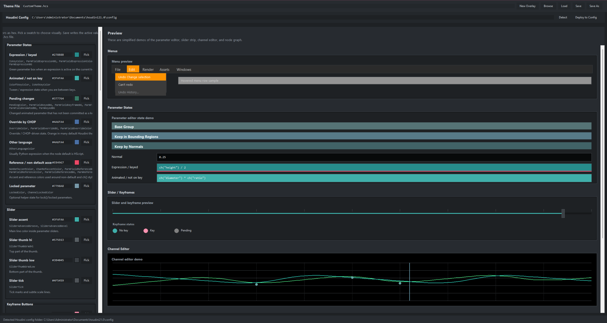

# Houdini Theme Editor

A standalone editor for Houdini `.hcs` theme files and `3DSceneColors` viewport/grid configs with live preview panels.

Houdini is a trademark of SideFX. This project is independent and is not affiliated with SideFX.



AI-assisted project. The code and project structure were reviewed, edited, and curated by the author.

本项目在开发过程中使用了 AI 辅助，代码与项目结构已由作者审阅、整理和确认。

This repository is prepared to be safe for GitHub publication:

- No Houdini theme files are included.
- No SideFX source files are copied into the repo.
- The editor can open a user-provided `.hcs` file.
- The editor can also create a new overlay theme that references the user's local `UIDark.hcs` through:

```hcs
#include "$HFS/houdini/config/UIDark.hcs"
```

That means the generated theme is only a user-authored override file, not a redistributed Houdini theme.

## Default Look

The editor's default fallback palette is initialized from the author's `QingKongShui_v2` look, but no `.hcs` preset file is bundled in this repository.

## Features

- Edit common Houdini UI theme colors as hex values
- Edit Scene View / viewport grid colors from `3DSceneColors`
- Visual pickers for each editable item
- Preview panels for:
  - parameter states
  - parameter group headers
  - menus
  - sliders and keyframes
  - channel editor
  - node graph
  - scene view / viewport grid
- Auto-detect Houdini `config` folders
- Deploy the current theme directly to the detected `config` folder
- Generate a channel-family palette from one base color
- Save As automatically syncs the internal `Scheme:` name to the file name
- Start from a fresh overlay theme without needing a bundled base file
- Switch cleanly between `.hcs` UI theme editing and `3DSceneColors` viewport editing
- Includes both Windows `.cmd` and Linux `.sh` launchers

## What Is Included

- `hcs_theme_editor.py`
- `theme_editor/`
- `launch_hcs_theme_editor.cmd`
- `launch_hcs_theme_editor.sh`
- this `README.md`
- `LICENSE`
- `.gitignore`

## Project Structure

- `hcs_theme_editor.py`: lightweight entry point
- `theme_editor/core.py`: `.hcs` and `3DSceneColors` parsing, color helpers, filesystem logic
- `theme_editor/bindings.py`: editable Houdini color bindings and section metadata
- `theme_editor/previews.py`: menu, parameter, slider, channel, node-graph, and scene-view preview drawing
- `theme_editor/app.py`: Tk UI shell, editing workflow, save and deploy actions

## What Is Not Included

- Houdini's original `.hcs` files
- Houdini icons, UI assets, or source files
- bundled finished theme preset files

## Running

Windows:

1. Double-click `launch_hcs_theme_editor.cmd`
2. Or run `python hcs_theme_editor.py`

Linux:

1. `chmod +x launch_hcs_theme_editor.sh`
2. `./launch_hcs_theme_editor.sh`
3. Or run `python3 hcs_theme_editor.py`

The launchers try these in order:

1. `HCS_THEME_EDITOR_PYTHON` environment variable
2. local virtualenv Python
3. `py -3` on Windows
4. `python`
5. `python3`

The app uses only Python standard-library modules.

## Workflow

Open an existing config:

1. Click `Browse`
2. Select a local `.hcs` or `3DSceneColors` file
3. Edit colors
4. `Save`, `Save As`, or `Deploy to Config`

Create a new overlay theme:

1. Click `New Overlay`
2. Edit colors
3. `Save As` to a new file like `MyTheme.hcs`
4. The editor will set `Scheme: MyTheme` automatically

## Houdini Config Deploy

The editor tries to detect user config folders like:

- `%USERPROFILE%\Documents\houdini21.0\config`
- `%HOUDINI_USER_PREF_DIR%\config`

Then `Deploy to Config` copies the current config file there.

## Notes

- Houdini key names can vary a little between versions.
- The preview is an approximation intended to make iteration faster.
- Houdini is a trademark of SideFX. This project is independent and is not affiliated with SideFX.

---

# Houdini 主题编辑器

这是一个带实时预览面板的 Houdini `.hcs` 主题编辑器。

这个仓库已经按可公开上传 GitHub 的方式整理好了：

- 不包含任何 Houdini 原始主题文件
- 不复制任何 SideFX 源文件到仓库里
- 编辑器可以打开用户自己提供的 `.hcs` 文件
- 也可以直接新建一个 overlay 主题，并通过下面这行引用用户本机的 `UIDark.hcs`

```hcs
#include "$HFS/houdini/config/UIDark.hcs"
```

也就是说，这个工具生成的是“用户自己的 override 文件”，不是重新分发 Houdini 主题源文件。

## 默认风格

编辑器默认的 fallback 配色已经初始化为作者的 `QingKongShui_v2` 风格，但仓库里不会附带对应的 `.hcs` 成品文件。

## 功能

- 用十六进制直接编辑常见 Houdini 主题颜色
- 每个项目都有取色器
- 内置预览面板：
  - 参数状态
  - 参数分组标题条
  - 菜单
  - slider 和 keyframe
  - channel editor
  - node graph
- 自动检测 Houdini `config` 目录
- 一键部署当前主题到检测到的 `config` 目录
- 用一个基础颜色自动生成 channel family palette
- `Save As` 时自动把内部 `Scheme:` 同步成文件名
- 不需要仓库内自带 base theme 文件，也能直接新建 overlay 主题

## 仓库包含

- `hcs_theme_editor.py`
- `theme_editor/`
- `launch_hcs_theme_editor.cmd`
- 当前这个 `README.md`
- `LICENSE`
- `.gitignore`

## 项目结构

- `hcs_theme_editor.py`：轻量入口文件
- `theme_editor/core.py`：`.hcs` 解析、颜色工具和文件系统逻辑
- `theme_editor/bindings.py`：可编辑的 Houdini 颜色绑定与分组元数据
- `theme_editor/previews.py`：菜单、参数、slider、channel、node graph 的预览绘制
- `theme_editor/app.py`：Tk 界面主体、编辑流程、保存与部署动作

## 仓库不包含

- Houdini 原始 `.hcs` 文件
- Houdini 图标、UI 资源或源文件
- 已完成的主题预设成品文件

## 运行方式

Windows：

1. 双击 `launch_hcs_theme_editor.cmd`
2. 或者执行 `python hcs_theme_editor.py`

启动器会按这个顺序尝试 Python：

1. `HCS_THEME_EDITOR_PYTHON` 环境变量
2. `.venv\Scripts\python.exe`
3. `py -3`
4. `python`
5. `python3`

这个工具只使用 Python 标准库。

## 使用流程

打开现有主题：

1. 点击 `Browse`
2. 选择本地 `.hcs` 文件
3. 修改颜色
4. 使用 `Save`、`Save As` 或 `Deploy to Config`

新建 overlay 主题：

1. 点击 `New Overlay`
2. 修改颜色
3. `Save As` 成新的文件，比如 `MyTheme.hcs`
4. 编辑器会自动写成 `Scheme: MyTheme`

## 部署到 Houdini Config

编辑器会尝试自动检测类似下面的用户目录：

- `%USERPROFILE%\Documents\houdini21.0\config`
- `%HOUDINI_USER_PREF_DIR%\config`

然后 `Deploy to Config` 会把当前主题文件直接复制过去。

## 说明

- 不同 Houdini 版本里，颜色键名可能会有少量差异
- 预览面板是为了加快调色而做的近似模拟，不是逐像素复刻
- Houdini 是 SideFX 的商标；这个项目是独立工具，与 SideFX 无官方关联
